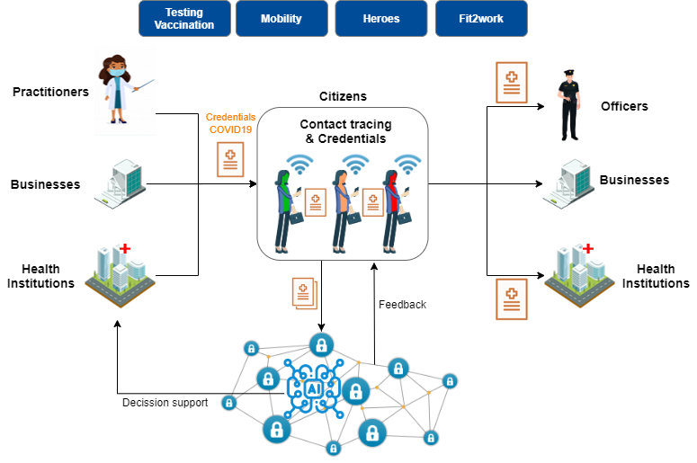

# Immunisation and collective knowledge with Verifiable Credentials and Blockchain for social recovery after the pandemia

The urgency is presently on fighting the Coronavirus pandemic and its immediate consequences. We should however <b style="color: red;">start to prepare the measures necessary to get back to a normal functioning of our societies and economies and to sustainable growth,</b>
integrating inter alia the green transition and the digital transformation, and drawing all lessons from the crisis. This will require a coordinated exit strategy, a comprehensive recovery plan and unprecedented investment.

<cite>[Joint statement of the Members of the European Council (26 March 2020)](https://www.consilium.europa.eu/media/43076/26-vc-euco-statement-en.pdf)</cite>

## Please visit the [project web site](https://alastria.github.io/anti-pandemia/)

