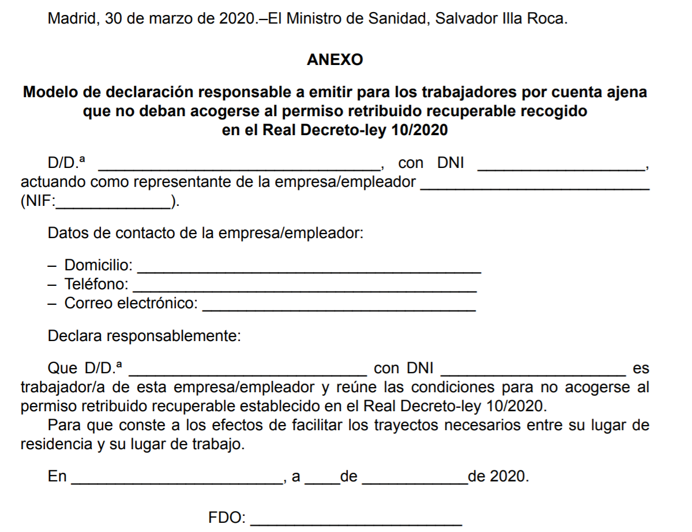

# Post Pandemic social recovery with Verifiable Credentials and Blockchain

## Health and social recovery after the crisis

> *"In view of preparing for when the spread of the virus is under control, it is important to develop robust criteria to eventually lift – as much as possible in a coordinated manner -some of these measures and establish alternative ones to monitor and curb the expansion of the virus."*
>
> -- <cite>[European Commission’s advisory panel on COVID-19 (22 March 2020)](https://ec.europa.eu/health/sites/health/files/preparedness_response/docs/ev_20200322_sr_en.pdf)</cite>

To help in times of pandemic crisis (eg. [COVID-19](https://en.wikipedia.org/wiki/2019%E2%80%9320_coronavirus_pandemic)) and for social recovery after the initial crisis, this application uses [Verifiable Credentials](https://en.wikipedia.org/wiki/Verifiable_credentials) (VCs) to associate immunisation & health information to citizens.
We use VCs to:

* **increase privacy** and data control by the user, compared to the equivalent centralized applications developed in other regions like China or Korea,
* **improve the interoperability** and usage of this data **across borders in the European Union** to enable coordination (and with other regions with proper agreements),
* **without requiring a centralized repository**.

The application uses a public decentralized registry to check the validity of the public identities of practitioners, professionals and institutions that may be involved. The application can be configured to verify those public identities against several such repositories, like **[EBSI](https://ec.europa.eu/cefdigital/wiki/display/CEFDIGITAL/EBSI){:target="_blank"}**, **[Alastria Red T](http://netstats.telsius.alastria.io/){:target="_blank"}** or **[LaCChain](https://www.iadb.org/en/news/global-alliance-promote-use-blockchain-latin-america-and-caribbean){:target="_blank"}**. It is even possible to use centralized systems (with the condition that they be trusted).

Most interactions among participants happen **off-chain** with high levels of privacy, scalability and flexibility. However, the citizen can provide **explicit consent** in the form of VCs to enable the application to send some specific information to the health authorities of each country.

In addition, the application can:

- Provide **information to health authorities** to make better operational decisions through higher levels of traceability of the health status of citizens, including vaccines and vaccination procedures.
- Use **color coded schemas for social interactions** to provide information to improve protection and prevention of people during an epidemic or pandemic situation. Color coding can be more sophisticated than current schemes, thanks to the use of VCs.
- Use exactly the same mechanism to deliver to the citizens other useful credentials during the post-crisis recovery of the society, for example **temporary permits** for going to work, visiting family or travelling, both inside a country and across borders.

## Support for health-related measures when lifting lockdown restrictions

One possible future scenario is that the transmission of the new coronavirus SARS-CoV-2 (nCOV) can not be fully eliminated in the short term and so recurrent outbreaks will happen during the coming months. This is due to the high transmissibility, short incubation period and low percentage of immunized population. Even if we use effectice infection control measures, it is very probable that some cases could escape from the epidemiologic control. The risk of new outbreaks will only be reduced as people becomes more protected because they have gone through the infection and later on because the impact of generalized vaccination.

In order to illustrate how mobile applications could help, a [possible](https://964f74da-ef80-4d30-819c-e4bc9748a9a1.filesusr.com/ugd/e7cd86_ff6a3149457f4b6c96a4f603ea9a4a02.pdf) sequence of events could be the following:

* Lifting gradually the restrictions on lockdown, starting with low-risk population groups. Verifiable Credentials of different types could be used to grant permissions to different groups of people. 
* Evaluation of the immunity of the population. This requires massive testing, in different points of control where the citizen can go either wolking or by vehicle. Verifiable Credentials with the results of the testing can be delivered at the place of testing, including a Certificate of Immunisation. Immune individuals could be issued with a kind of vaccination certificate, which would allow them to be exempted from restrictions on their activities
* Early detection of cases and contacts. The mobile application can allow different mechanisms, like proximity tracing or social collaboration, including self-attested health status (temparature, cough, tiredness, ...).
* Confinement measures if hot spots detected with monitoring. The mobile application could support during confinement of people.

## Support for *Responsible Declarations* of many types

In addition, in a situation of pandemia there are a lot of exceptions to the normal situation, and these exceptional procedures have to be managed. In many cases, this implies the usage of so-called **responsible declarations**, normally as paper forms with related data and hand-written signatures. The following figure is and official form published by the Health Ministry of Spain:

{: style="width:500px" }

And the following is a self-declaration published by the Ministry of Health of Italy:

{: style="width:500px" }

!!! note
    This project is heavily inspired by the [healthcrisis](https://github.com/disposableidentities/healthcrisis) initiative, but it has been adapted to leverage ESSIF and in general the existing EBSI infrastructure and components.
