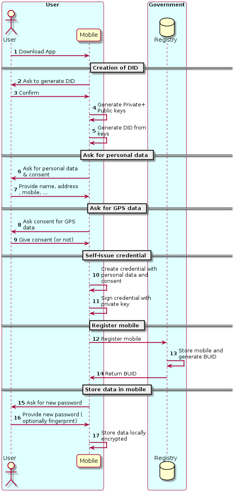

# Onboarding of natural persons

## Citizens

ESSIF-MVP1 and the current AlastriaID implementation use “classic” **ledger-based** DIDs (i.e. DIDs registered on a Blockchain). In [DIF](https://identity.foundation/) (Decentralized Identity Foundation), other types of DIDs are available, such as “peer” DIDs that are **not registered** on a blockchain/DLT.

The following considerations apply to “classic” ledger-based DIDs:

* They can be called “omnidirectional” or **“anywise”** identifiers, because **anyone** (with read access to the DLT used for DID registration) can **resolve them globally**.

* They require privacy considerations due to certain attributes of Blockchains (e.g. immutability) which are in tension with the GDPR.

* They are particularly useful for DID Subjects who are Issuers of Verifiable Credentials (because Verifiable Credentials contain information about the Issuer, e.g. their DID).

* They are resolved using a global “source of truth” based on strong consistency and integrity guarantees offered by Blockchains and similar networks.

The following considerations apply to “peer” DIDs:

* They can be called “unidirectional” or “pairwise” identifiers, meaning that **only one party** other than the DID Subject (or a limited group of parties) **can resolve them**.

* The use of such identifiers is considered **best practice** under a principle known as **directed identity** and since they are not registered on a Blockchain there are no tensions with data protection regulations.

* They may have **weaker consistency and integrity guarantees** than “classic” ledger-based DIDs (because they are not stored on a Blockchain).

In order to facilitate massive onboarding of citizens, we will enable the usage of **pairwise** DIDs, in addition to the current ledger-based DIDs. When it is not practical or feasible to use ledger-based DIDs, the citizens will have the possibility to use pairwise DIDs.
Essentially, the onboarding process consists on the creation of the SSI identity, in the form of a DID.
In this use case, we do not require that citizen identities are of the highest level according to the eIDAS classification and we can start with lower levels and escalate levels later.

An example using a process similar to the one used by many of the current coronavirus self-diagnostic apps is the following:

**(1)** The citizen downloads the official app published by the health authorities.

**(2) and (3)** Initiate the creation of the DID.

**(4) and (5)** The mobile generates the DID locally without registering the DID in any external system (so this DID will not be anchored to any blockchain).
The DID is stored in the mobile only.

**(6) and (7)** The citizen fills a form with some personal information like name, surname and phone number.

**(8) and (9)** The citizen provides consent to use GPS data (or not).

**(10) and (11)** The mobile creates a self-issued credential which is stored only in the mobile.

**(12), (13) and (14)** The citizen registers the mobile with the health authorities. The only verification method consists on sending an SMS to the mobile with an authorization code, which only verifies that the user controls the mobile but it does not verify the personal data.
The health authorities send back also a BUID (Bluethooth Unique ID), to be used for the proximity tracking functionality.

**(15), (16) and (17)** All personal data is stored in the mobile, encrypted under a password provided by the citizen.

Later on (described in more detail in another section) when visiting a doctor, the doctor verifies the real identity of the citizen and then acts in the role of **practitioner** and issues a credential to the citizen, signed by the private key of the DID of the doctor (which can be verified by anybody with read access to the blockchain).
The credential issued by the doctor will include the personal data that the citizen entered when creating her self-issued credential.

The citizen will then store the credential issued by the doctor in her mobile device. She can present the credential to any other entity, and the verifier can know that a doctor issued a statement about that citizen, including the verification of her personal data.

The next paragraph describes the onboarding process. For the other interactions, see the appropiate chapters.

### Sequence diagram for citizen onboarding

After this process, the citizen has in her mobile a self-issued credential which is not yet validated by anybody, so the trust on the included personal data is very low.
However, this data will be validated to some extent when a practitioner issues a health status credential, as shown in the following diagram.

## Practitioners and Officials

In the case of doctors, the health authority of each country will issue a Verifiable Credential to the doctor, including some of the relevant information (eg. medical board number).

The same applies to other types of officials, where the relevant official entity will issue credentials to all those officials.

