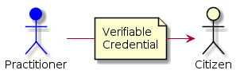
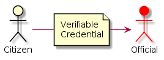
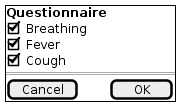
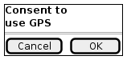
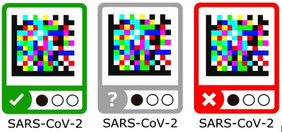

# Functional requirements

## Practitioners and private labs can issue credentials to citizens

Health practitioners will issue to citizens different types of health status situation reports as special Verifiable Credentials. The credentials issued by practitioners will be based on lab tests, vaccination, diagnostics, etc.

The health condition credentials are tied to the digital identity of the issuing party. In case of practitioners this should be tied to their professional credentials, which are public and issued by the corresponding official entities (the process may depend on the specific country). All data exchanges are accompanied by a GDPR consent encoded as Verifiable Claim so that legitimate use of the data can be proved.

The system allows practitioners to issue credentials to citizens directly, just using their mobile phones while on the field, for example. Without requiring complex and expensive integrations with backend systems of health institutions or other entities. The same concept should apply to private labs, in countries where this is applicable and in order to facilitate the coordination with the national health services.

## Citizens can present their credentials to officials

Communication is in general P2P (app-2-app), achieving very high levels of privacy. It includes the ability to use a simple QR based system for sending/receiving VCs to enable simple phone-to-phone verification of a credential without previous relationship among the participants. For example, when a citizen is walking in the street and an official has to verify that the citizen has the corresponding permit. The citizen can just display the QR representing the VC and the official can scan the QR and verify it.

This behaves in much the same way as paper credentials but in a much more secure and convenient way.
Except that health conditions can change a lot with time, so these health condition credentials will be regularly updated and timestamping will determine which is most recent. For each latest health condition credential, a QR can be generated by the citizen using a smartphone and this code can be read by another smartphone, either a practitioner, an official or other citizen. **No physical contacts or pre-established relationship** among parties are needed. These QRs are destroyed (as they are only digital, this means that they will not resolve any information) when a new health condition credential is created.

## Citizens can self-attest their health status using questionnaires

Citizens can self-attest their health status using questionnaires, in a similar way that is done now with some apps developed in some countries for coronavirus crisis management. These credentials are of a different nature, being self-issued and not fully verified by an authority, but they have proven to be of immense value in times of crisis. A simple verification with the mobile number, even if not legally binding, can be very useful in these situations.

## Citizens can provide consent to use personal data

Citizens can provide consent to use personal data embedded in the credentials, including the GPS coordinates in their phones for different purposes, which can range from full tracking to explicit geo-tagging of some VC when the citizen considers it adecuate (for example for self-attestation of compliance with quarantine). Some messages can be automatically collected in a central server (there may be one per country depending on the citizen), and the aggregated information from many citizens can be used and analyzed.

## Color coding (color-blind friendly) in a safe and privacy-preserving way

{: style="width:180px" }

The information represented by these Verifiable Credentials can be used in a safe and privacy-preserving way for things like "color coding" citizens for their health condition regarding the infection status and places visited. Of course, it has to be done in a color-blind friendly way.

